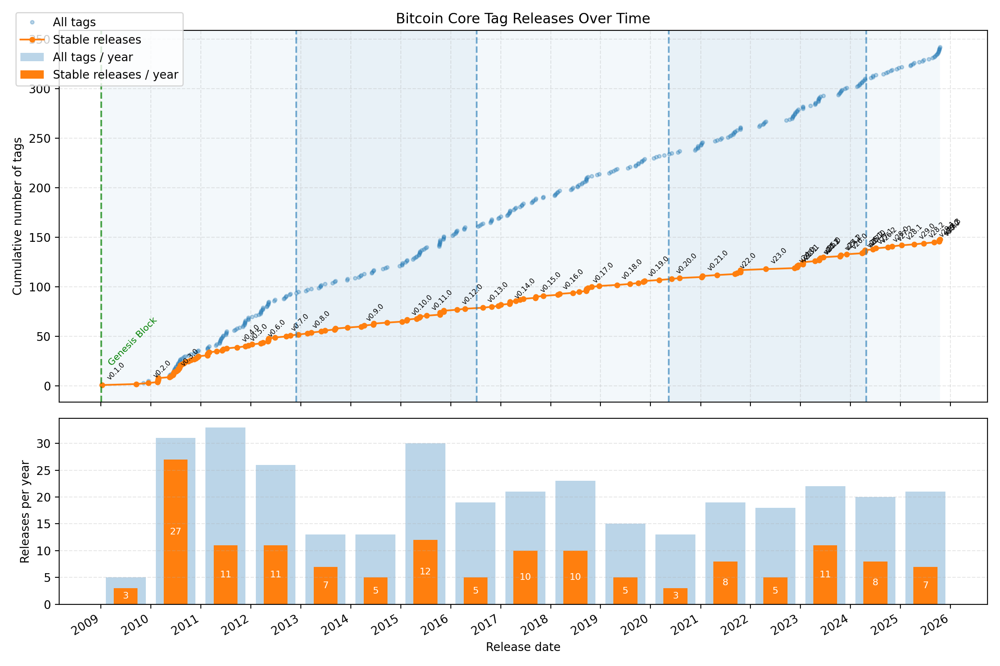

# Intro
This repo showcases Bitcoin release Tags charted alongside Bitcoin Halvings. 
It is a fun demo of webscraping + matplotlib practice all the while documenting the fun and unique history of Bitcoin's Open Source development. 

# Results

Above shows Bitcoin relase chart tag with year breakdown.

# Steps 
## Scrape Github for datapoints
python bitcoin_version.py

## Create Chart
python make_plot.py

# License 
This repo is released under the terms of the MIT license. See https://opensource.org/license/MIT.

# Last Updated
November 28, 2025
